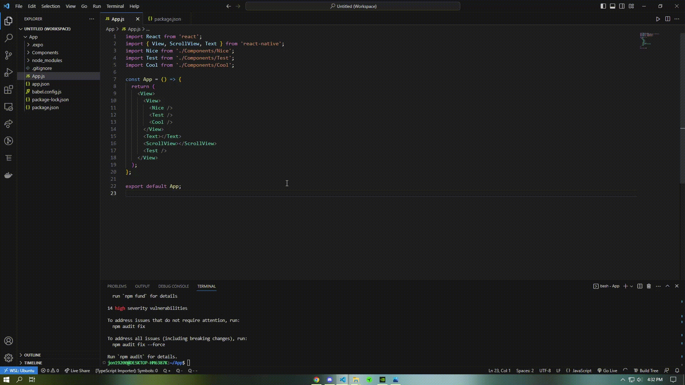

 
 
  
  

----

ProtoNative is a <b>React Native Prototyping Tool</b> for mobile developers. With its seamless drag-and-drop interface, live code preview, and much, much more, ProtoNative is your all-in-one tool for all things React Native.
 
 
  <a href="http://protonative.com/"><b>Download for Windows or Mac</b></a>

<!-- TABLE OF CONTENTS -->

## Table of Contents

<ol>
  <li>
    <a href="#built-with">Built with</a>
  </li>
  <li>
    <a href="#installation">Installation</a>
    <ul>
      <li><a href="#windows">Windows</a></li>
      <li><a href="#mac">Mac</a></li>
    </ul>
  </li>
  <li><a href="#how-it-works">How it works</a></li>
  <li><a href="#running-your-mobile-app">Running your mobile app</a></li>
  <li><a href="#contributing">Contributing</a></li>
  <li><a href="#our-team">Our Team</a></li>
  <li><a href="#license">License</a></li>
</ol>

#

### Built with

[![Typescript][TS.js]][TS-url][![JavaScript][JavaScript]][JavaScript-url][![React][React.js]][React-url][![Electron][Electron]][Electron-url][![ElectronBuilder][ElectronBuilder]][ElectronBuilder-url][![ReactDnD][ReactDnD]][ReactDnD-url][![Jest][Jest]][Jest-url][![Vite][Vite]][Vite-url][![Babel][Babel]][Babel-url][![Prettier][Prettier]][Prettier-url][![FileSaver][FileSaver]][FileSaver-url][![Prism][Prism]][Prism-url][![HTML5][HTML5]][HTML5-url][![CSS3][CSS3]][CSS3-url][![SASS][SASS]][SASS-url][![Git][Git]][Git-url]

 
 

## Installation

### Windows

1. Download the latest release for Windows [here](http://protonative.com/).
2. Run the installer.
3. Run ProtoNative from your desktop.

### Mac

1. Download the latest release for Mac [here](http://protonative.com/).
2. Run the installer.
3. If you get a warning that the app is from an unidentified developer, go to System Preferences > Security & Privacy > General and click "Open Anyway".
4. Run ProtoNative from your applications folder.

<a href="#readme-top">back to top</a>

 

## How it works

1. To get started, add React Native elements to the "App" canvas by dragging and dropping them from the bottom-left bin. Rearrange elements or drag them to the trash.
    <picture>
      <source media="(prefers-color-scheme: dark)" srcset="gifs/Adding-elements-to-App-Canvas.gif">
      <source media="(prefers-color-scheme: light)" srcset="gifs/Adding-elements-to-App-Canvas.gif">
      
    </picture>
    
 

2. When you feel like your app needs more depth, click the "Add Custom Component" button in the top-left corner and enter a name.

 

3. Add elements to your custom component by dragging them from the bottom-left bin onto the canvas in "Component Details."
    <picture>
      <source media="(prefers-color-scheme: dark)" srcset="gifs/Adding-custom-components.gif">
      <source media="(prefers-color-scheme: light)" srcset="gifs/Adding-custom-components.gif">
      
    </picture>

 

4. Creating a custom component will also add it to your "Add Child" bin, highlighted in purple. Drag and drop the component onto the app canvas or another component's details to add it.

 

5. Navigate between components by clicking on the component name in the "Components" section on the left side or add state variables. Remove state variables by clicking on their names.
     
    
    <picture>
      <source media="(prefers-color-scheme: dark)" srcset="gifs/Add-state-to-components.gif">
      <source media="(prefers-color-scheme: light)" srcset="gifs/Add-state-to-components.gif">
      
    </picture>

 

6. Switch to the "Tree" tab above your "App" canvas to see a visual representation of your app's structure.
    <picture>
      <source media="(prefers-color-scheme: dark)" srcset="gifs/tree-hierarchy-state.gif">
      <source media="(prefers-color-scheme: light)" srcset="gifs/tree-hierarchy-state.gif">
      
    </picture>

<a href="#readme-top">back to top</a>

## Running your mobile app

1. When you're ready to export your app, click the "Export" button in the top-right corner.
    <picture>
      <source media="(prefers-color-scheme: dark)" srcset="gifs/Export.gif">
      <source media="(prefers-color-scheme: light)" srcset="gifs/Export.gif">
      
    </picture>
    
 

2. Install dependencies and make any changes to your app as you see fit in a code editor of your choosing.

 

3. Run your app with "npm start" and scan the QR code using the Expo Go mobile app to view your application in real time.
    <picture>
      <source media="(prefers-color-scheme: dark)" srcset="gifs/Start-expo-app.gif">
      <source media="(prefers-color-scheme: light)" srcset="gifs/Start-expo-app.gif">
      
    </picture>

<a href="#readme-top">back to top</a>

## Contributing

Contributions are an incredibly important part of the open source community. Any contributions you make are **greatly appreciated**.

### Roadmap

1. Add support for more React Native components (React Native Paper)
2. Add support for more React Native APIs (React Navigation, React Native Gesture Handler, etc.)
3. Allow for custom styling of components
4. Add attribute editing for components (e.g. changing the text of a Text component)
5. Add connection to local storage for session persistence
6. Containerize the app for easier installation
7. Automate testing

### How to contribute

1. Fork the Project
2. Create your Feature Branch (`git checkout -b feature/AmazingFeature`)
3. Commit your Changes (`git commit -m 'Add some AmazingFeature'`)
4. Push to the Branch (`git push origin feature/AmazingFeature`)
5. Open a Pull Request (from `feature/AmazingFeature` to `dev`)
6. Create a new issue on GitHub

**Read about how to spin up ProtoNative for development [here](CONTRIBUTING.md).**

**We look forward to your exciting contributions!**

<a href="#readme-top">back to top</a>

## License

Distributed under the MIT License. See [LICENSE](LICENSE) for more information.

 

## Our Team

| Developed By|                                                                                                                                                         |                                                                                                                                                             |
| :-------------------: | :-----------------------------------------------------------------------------------------------------------------------------------------------------: | :---------------------------------------------------------------------------------------------------------------------------------------------------------: |
| Jonathan Klibansky |  |          |
| Matthew Kymn |  |  |
| Michelle Leong |  |  |
| Patricia Good |  |  |
| Raymond Ferrer |  |  |

 

Give a ⭐️ if this project helped you!

<a href="#readme-top">back to top</a>

[React.js]: https://img.shields.io/badge/react-%2320232a.svg?style=for-the-badge&logo=react&logoColor=%2361DAFB
[React-url]: https://reactjs.org/
[TS.js]: https://img.shields.io/badge/typescript-%23007ACC.svg?style=for-the-badge&logo=typescript&logoColor=white
[TS-url]: https://www.typescriptlang.org/
[JavaScript]: https://img.shields.io/badge/javascript-%23323330.svg?style=for-the-badge&logo=javascript&logoColor=%23F7DF1E
[JavaScript-url]: https://www.javascript.com/
[Jest]: https://img.shields.io/badge/-jest-%23C21325?style=for-the-badge&logo=jest&logoColor=white
[Jest-url]: https://jestjs.io/
[Vite]: https://img.shields.io/badge/vite-%23646CFF.svg?style=for-the-badge&logo=vite&logoColor=white
[Vite-url]: https://vitejs.dev/
[Git]: https://img.shields.io/badge/git-%23F05033.svg?style=for-the-badge&logo=git&logoColor=white
[Git-url]: https://git-scm.com/
[CSS3]: https://img.shields.io/badge/css3-%231572B6.svg?style=for-the-badge&logo=css3&logoColor=white
[CSS3-url]: https://developer.mozilla.org/en-US/docs/Web/CSS/
[HTML5]: https://img.shields.io/badge/html5-%23E34F26.svg?style=for-the-badge&logo=html5&logoColor=white
[HTML5-url]: https://developer.mozilla.org/en-US/docs/Web/HTML/
[SASS]: https://img.shields.io/badge/SASS-hotpink.svg?style=for-the-badge&logo=SASS&logoColor=white
[SASS-url]: https://sass-lang.com/
[Electron]: https://img.shields.io/badge/Electron-191970?style=for-the-badge&logo=Electron&logoColor=white
[Electron-url]: https://www.electronjs.org/
[ElectronBuilder]: https://img.shields.io/badge/Electron_Builder-2094f3?style=for-the-badge&logo=electron-builder&logoColor=white
[ElectronBuilder-url]: https://www.electron.build/
[Babel]: https://img.shields.io/badge/Babel-323330?style=for-the-badge&logo=Babel
[Babel-url]: https://babeljs.io/
[Prism]: https://img.shields.io/badge/Prism-blue?style=for-the-badge&logo=Prisma
[Prism-url]: https://Prismjs.com/
[FileSaver]: https://img.shields.io/badge/FileSaver-darkgreen?style=for-the-badge&logo=Files&logoColor=white
[FileSaver-url]: https://www.npmjs.com/package/file-saver
[Prettier]: https://img.shields.io/badge/Prettier-1a2b34?style=for-the-badge&logo=Prettier
[Prettier-url]: https://prettier.io/
[ReactDnD]: https://img.shields.io/badge/React_DnD-%2320232a?style=for-the-badge&logo=createreactapp
[ReactDnD-url]: https://react-dnd.github.io/react-dnd/about
